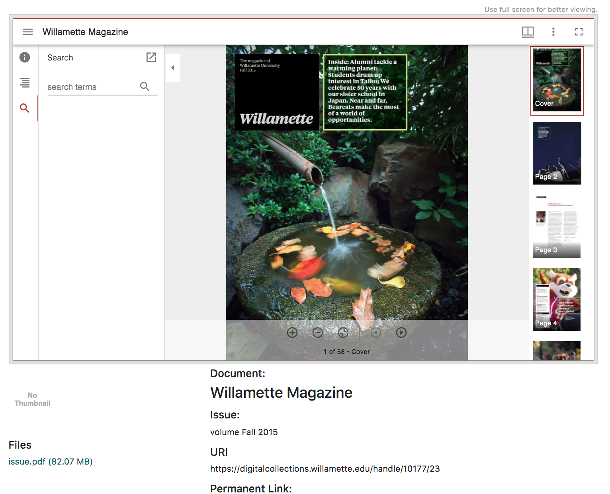

# Overview

This IIIF proposal relies on two core features of DSpace. 

* The `bundle` layer: The implementation uses bundles to identify bitstreams that will be added 
  to IIIF canvases (the `IIIF` bundle) or to related resource annotation lists (the `OtherContent` bundle). 
  The bundles also assure that bitstreams (and therefore canvases) appear in the proper order in the manifest.
  
* The `entity.type` feature: This is new with DSpace 7 and is used to flag items as IIIF resources. 
  Items with an `entity.type` of `IIIF` or `IIIFSearchable` incorporate the Mirador viewer into the  
  display and initialize the viewer with the manifest URL of the item. Also, `IIIFSearchable` entities are  
  initialized with the search results when the item is retrieved from a DSpace discovery result list.

To render an item as IIIF both conditions are required.  The `entity.type` must be one of the two IIIF types, 
and bitstreams must be added to the `IIIF` bundle.

These requirements have implications.

* The assets in the `IIIF` bundle are viewed and accessed only via the IIIF viewer. The IIIF viewer also provides 
  downloads and citation information for these assets. Any bitstreams in the default `ORIGINAL` bundle continue to 
  be accessed via the DSpace Item UI as before. 
  
* Existing DSpace records with images in the `ORIGINAL` bundle need to be modified by transferring assets to the 
  `IIIF` bundle. There may of course be ways to avoid this requirement, but those have not yet been explored.  
  
The screenshot below shows a record in which bitstreams in the `IIIF` bundle are rendered in the viewer. Meanwhile, a link to the
PDF version of the item is provided in the DSpace UI. Note that the PDF version can also be downloaded via the Mirador viewer.

Overall, the decision to rely on bundles probably deserves analysis and discussion. My sense is that the bundle layer
provides a clean and helpful separation for managing assets and creating views but there may be other ways to look
at this.




# Additional metadata using info.json

Bitstream objects lack 3 metadata fields
that are important for the IIIF implementation. The ability to add meaningful labels to bitstreams, such as "cover", "chapter",
"side", "back", and other more domain-specific labels is a basic requirement. The IIIF spec also recommends accurate height and width 
dimensions for canvases, based on the size of image to be rendered. These requirements could be addressed by adding metadata
fields to the bitstream. For now, that is beyond the scope of the initial pull request. I opted
instead to provide this metadata via a json file that resides in the `IIIF` bundle. 

The `info.json` file is a work-in-progress. Details are [provided in the PR description](https://github.com/DSpace/DSpace/pull/3210). 
Note that this `info.json` file is not required ... but is recommended.  Without the file the IIIF manifest will be 
rendered using default labels and height/width values.

One caveat is that there's currently no tooling for creating or modifying the `info.json` file. It would not be difficult to
do this in a separate PR, either for the `info.json` file itself or for additional bitstream metadata if we decide that's 
the best solution.

One final note about metadata.  IIIF `ranges` are a nifty way to create navigation within a multi-image document. I've
included this in the `info.json sequences` property as an array. It may also be possible to create manifest ranges by adding a 
range property to bitstream metadata. 


# Additional Requirements

Creating a record with images in the `IIIF` bundle and with an IIIF `entity.type` will embed the Mirador viewer in the
Angular UI and query the REST API for the manifest. To render images, the viewer needs to know how to request images from
the image server.

## Image Server

Here's a quick description of how the cantaloupe image server is integrated with DSpace.  

The path to the server provided in an IIIF configuration property in local.cfg.

`iiif.image.server = https://digitalcollections.willamette.edu/image-server/cantaloupe-4.1.7/iiif/2/`

This configuration property is used in the image service definition that is embedded in the IIIF manifest
and returned by the DSpace REST API to Mirador:

```
service: {
  @context: "http://iiif.io/api/image/2/context.json",
  @id: "https://digitalcollections.willamette.edu/image-server/cantaloupe-4.1.7/iiif/2/181c0dd2-e661-43d8-8bbc-648705bfe490",
  profile: "http://iiif.io/api/image/2/level1.json",
}

```

Here is an example of the Image API request URL from Mirador to the cantaloupe server:

`https://digitalcollections.willamette.edu/image-server/cantaloupe-4.1.7/iiif/2/181c0dd2-e661-43d8-8bbc-648705bfe490/full/674,/0/default.jpg`

Cantaloupe is configured to use an `HttpSource` and a `ScriptLookupStrategy` defined in `delegates.rb`. It retrieves the image 
from DSpace and returns the processed image.

```
def httpsource_resource_info(options = {})
        identifier = context['identifier']
        identifier.gsub(/^(.{36})/, "http://dspace-new.willamette.edu:8080/server/api/core/bitstreams/\\1/content")
  end
  ```

## Solr Search Index

The IIIF Search API uses a Solr index.  Details are [described in the pull request](https://github.com/DSpace/DSpace/pull/3210).


# Import Process

Because I have a large data migration in mind, I am using the Simple Archive Format to batch import items to DSpace. Here's 
an abbreviated contents file that illustrates the bundles and files described above. 

```
199701.pdf
alto_1.xml  bundle:OtherContent
alto_2.xml  bundle:OtherContent
001.jp2 bundle:IIIF
002.jp2	bundle:IIIF
info.json	bundle:IIIF
```

For the Search API and Solr index, I am currently populating Solr with separate Python load process.  I think there is a 
way to integrate this more closely with the DSpace ingestion process by requiring inclusion of ALTO files in the `OtherContent` 
bundle. This would allow a separate process running on the Solr server to retrieve item manifests and ALTO files via 
an AnnotationList and use this information to build and maintain the Solr index. Perhaps ultimately providing a way to 
automatically synchronize the Solr index with items that use the Search API, or at least make it easy to manually trigger
an update of items from a collection.
